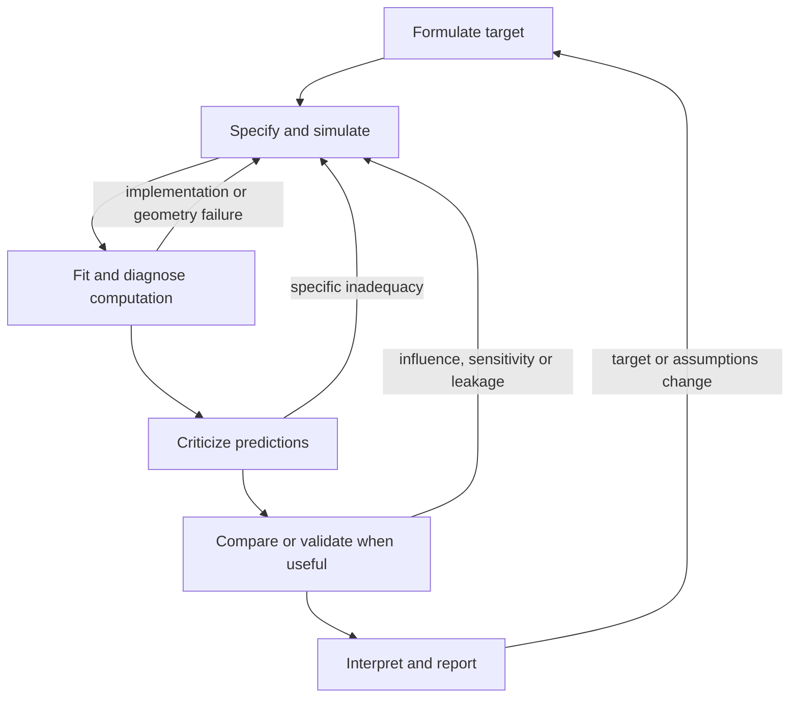

# Iterative workflow and stopping

Basis: W01–W05 in [source map](source-map.md). This process is a synthesis of the model sequences, not a claim that every case follows one order.

## States and return conditions

| State | Evidence required to leave | Return trigger |
|---|---|---|
| Formulate | Estimand, target population, observation/assignment process and conditioning are explicit | A proposed parameter does not answer the question; validation target changes; design cannot identify quantity |
| Specify | Generative model has meaningful units/support and necessary dependencies | Predictive mismatch suggests wrong observation/dependence structure; code exposes impossible inputs |
| Simulate | Prior predictions plausible for the task; new components behave on known data | New priors, transformations, hierarchy or latent components; recovery/implementation uncertainty |
| Fit provisionally | Program runs and exploratory computation permits targeted inspection | Numerical failures, invalid support, failed generator or indexing |
| Diagnose computation | Credible posterior exploration and QOI-specific precision | R-hat/ESS/MCSE, divergences, unexplored modes or solver instability undermine reliability |
| Criticize model | Named scientific/PPC questions answered, with remaining discrepancies assessed | Misfit, influence or sensitivity affects estimand; observed structure absent from generator |
| Revise | A hypothesis, small intervention and falsifiable validation recorded | Intervention fails or creates new identification/computational risk |
| Compare/validate | Appropriate validation unit, reliable predictive scores and honest uncertainty | High k, leakage, different score measures, winner still inadequate, selection overfitting |
| Interpret/report | Assumptions and limitations match the supported claim | Plausible alternative changes conclusion; uncertainty/decision precision inadequate |

Model comparison can occur early to screen candidates (dogs), but cannot replace checking the chosen model (roaches). Fitting is not a gate that must precede every useful thought: graphical data inspection, scientific constraints and simple simulation may diagnose an error first. Sensitivity and calibration can occur throughout development rather than being terminal rituals.

## Keep a small model register

For each retained version record formula/generator, data IDs, estimand, transformations, priors, seed/software, fit settings, observed failures, attempted intervention and validation. Preserve a working predecessor. Record comparisons on unchanged targets; changes of response aggregation, baseline conditioning or validation unit require a separate comparison record.

Before revising, write:

- Observed inadequacy and its relevance to the scientific quantity.
- Competing explanations and the check that separates them.
- Proposed change and expected observable consequence.
- New identification/prior/computational risks.
- Result after repeating old checks and adding the new targeted check.

## Stop without searching for a true model

Accept task adequacy when exploration and MC accuracy support reported quantities, relevant predictive checks do not reveal material failures, plausible sensitivity alternatives preserve the scientific conclusion/decision, and added complexity yields little useful information. If a remaining discrepancy affects only an irrelevant part of the distribution, explain why; do not conceal it. If a quantity remains unidentifiable, stop with a narrower claim or a data/design recommendation. A model may be useful yet require explicit restrictions for extrapolation or new populations.

Anti-patterns supported across cases: writing the final latent hierarchy immediately; unexamined priors; interpreting coefficients before model checking; treating convergence as validation; defaulting to adapt_delta; ranking inadequate models; selecting by one information criterion; printing precision unsupported by MC/scientific uncertainty; assuming longer chains solve redundancy; ignoring influential observations; broad priors for weak nonlinear components; assuming all hierarchical models prefer non-centering; delaying all SBC until complexity prevents debugging. See the corresponding canonical modules for remedies rather than adopting a blanket prohibition.
