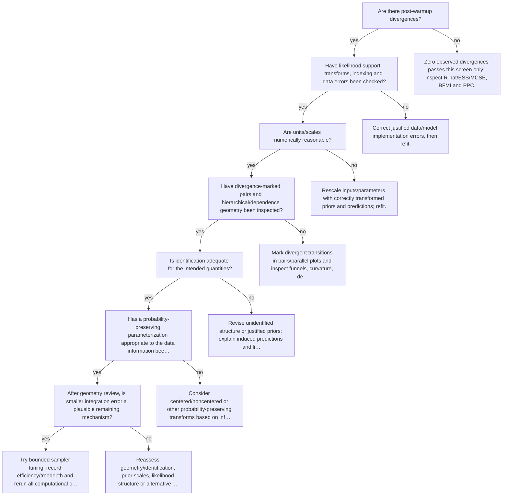

# Diagnose divergent HMC trajectories

Executable specification: [`trees.json`](trees.json), tree `divergences`. Supply boolean facts only after inspecting evidence. Omitted facts follow **unknown** and request a check. A terminal action is a next step, not an automatic declaration of adequacy; after an intervention rerun the named trees.

| Fact | Required evidence / question |
|---|---|
| `post_warmup_divergences` | Are there post-warmup divergences? |
| `data_support_valid` | Have likelihood support, transforms, indexing and data errors been checked? |
| `scales_reasonable` | Are units/scales numerically reasonable? |
| `geometry_localized` | Have divergence-marked pairs and hierarchical/dependence geometry been inspected? |
| `identification_sound` | Is identification adequate for the intended quantities? |
| `reparameterization_reviewed` | Has a probability-preserving parameterization appropriate to the data information been considered? |
| `tuning_plausible` | After geometry review, is smaller integration error a plausible remaining mechanism? |

## Routes

Unknown branches and full action text are intentionally in the executable specification. Conditional recommendations in action text still require the named evidence; the runner does not fit models or infer boolean facts from incomplete summaries.

Evidence: statistical guides linked by each action; graph/action ordering `synthesized` from E15 and diagnostic modules.
