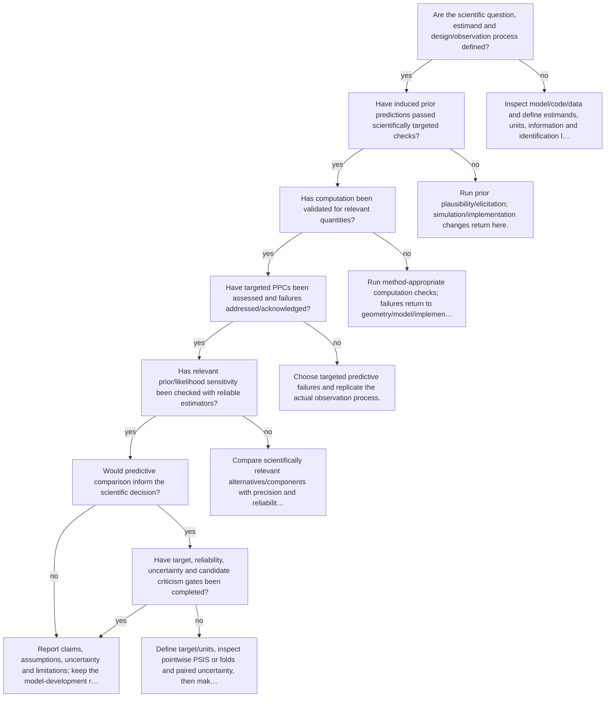

# Route the next analysis step

Executable specification: [`trees.json`](trees.json), tree `end-to-end`. Supply boolean facts only after inspecting evidence. Omitted facts follow **unknown** and request a check. A terminal action is a next step, not an automatic declaration of adequacy; after an intervention rerun the named trees.

| Fact | Required evidence / question |
|---|---|
| `scientific_target_defined` | Are the scientific question, estimand and design/observation process defined? |
| `prior_checked` | Have induced prior predictions passed scientifically targeted checks? |
| `computation_adequate` | Has computation been validated for relevant quantities? |
| `ppc_done` | Have targeted PPCs been assessed and failures addressed/acknowledged? |
| `sensitivity_done` | Has relevant prior/likelihood sensitivity been checked with reliable estimators? |
| `comparison_useful` | Would predictive comparison inform the scientific decision? |
| `comparison_valid` | Have target, reliability, uncertainty and candidate criticism gates been completed? |

## Routes

Unknown branches and full action text are intentionally in the executable specification. Conditional recommendations in action text still require the named evidence; the runner does not fit models or infer boolean facts from incomplete summaries.

Evidence: statistical guides linked by each action; graph/action ordering `synthesized` from E15 and diagnostic modules.
