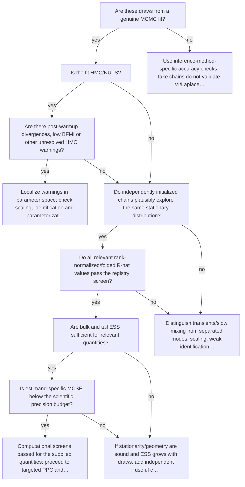

# Validate computation

Executable specification: [`trees.json`](trees.json), tree `mcmc`. Supply boolean facts only after inspecting evidence. Omitted facts follow **unknown** and request a check. A terminal action is a next step, not an automatic declaration of adequacy; after an intervention rerun the named trees.

| Fact | Required evidence / question |
|---|---|
| `is_mcmc` | Are these draws from a genuine MCMC fit? |
| `hmc` | Is the fit HMC/NUTS? |
| `hmc_warnings` | Are there post-warmup divergences, low BFMI or other unresolved HMC warnings? |
| `stationary` | Do independently initialized chains plausibly explore the same stationary distribution? |
| `rhat_pass` | Do all relevant rank-normalized/folded R-hat values pass the registry screen? |
| `ess_pass` | Are bulk and tail ESS sufficient for relevant quantities? |
| `mcse_pass` | Is estimand-specific MCSE below the scientific precision budget? |

## Routes

Unknown branches and full action text are intentionally in the executable specification. Conditional recommendations in action text still require the named evidence; the runner does not fit models or infer boolean facts from incomplete summaries.

Evidence: statistical guides linked by each action; graph/action ordering `synthesized` from E15 and diagnostic modules.
