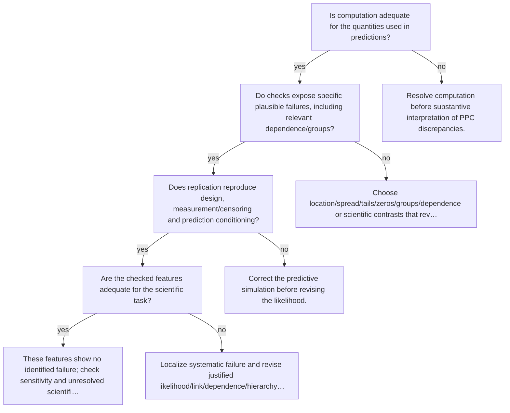

# Choose and respond to targeted PPC

Executable specification: [`trees.json`](trees.json), tree `ppc`. Supply boolean facts only after inspecting evidence. Omitted facts follow **unknown** and request a check. A terminal action is a next step, not an automatic declaration of adequacy; after an intervention rerun the named trees.

| Fact | Required evidence / question |
|---|---|
| `computation_adequate` | Is computation adequate for the quantities used in predictions? |
| `targeted_quantities` | Do checks expose specific plausible failures, including relevant dependence/groups? |
| `observation_replication_correct` | Does replication reproduce design, measurement/censoring and prediction conditioning? |
| `ppc_features_adequate` | Are the checked features adequate for the scientific task? |

## Routes

Unknown branches and full action text are intentionally in the executable specification. Conditional recommendations in action text still require the named evidence; the runner does not fit models or infer boolean facts from incomplete summaries.

Evidence: statistical guides linked by each action; graph/action ordering `synthesized` from E15 and diagnostic modules.
