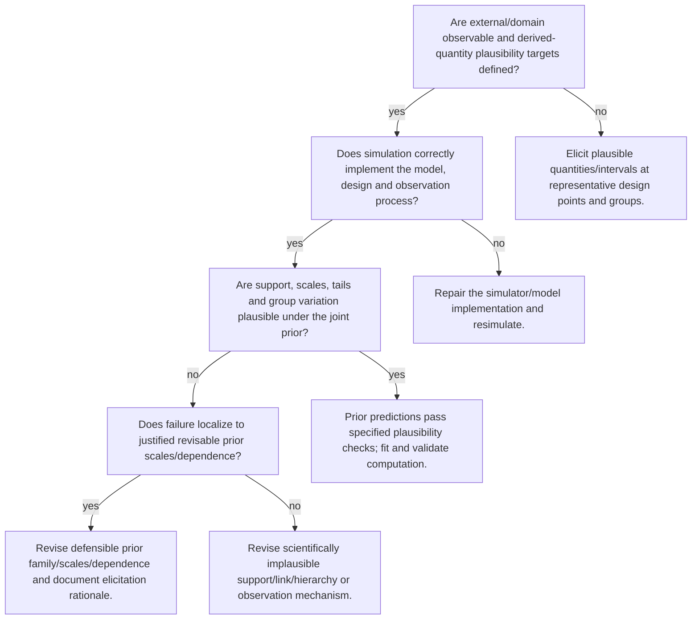

# Respond to prior predictive failure

Executable specification: [`trees.json`](trees.json), tree `prior-predictive`. Supply boolean facts only after inspecting evidence. Omitted facts follow **unknown** and request a check. A terminal action is a next step, not an automatic declaration of adequacy; after an intervention rerun the named trees.

| Fact | Required evidence / question |
|---|---|
| `plausibility_targets` | Are external/domain observable and derived-quantity plausibility targets defined? |
| `generator_correct` | Does simulation correctly implement the model, design and observation process? |
| `prior_predictions_plausible` | Are support, scales, tails and group variation plausible under the joint prior? |
| `prior_cause` | Does failure localize to justified revisable prior scales/dependence? |

## Routes

Unknown branches and full action text are intentionally in the executable specification. Conditional recommendations in action text still require the named evidence; the runner does not fit models or infer boolean facts from incomplete summaries.

Evidence: statistical guides linked by each action; graph/action ordering `synthesized` from E15 and diagnostic modules.
