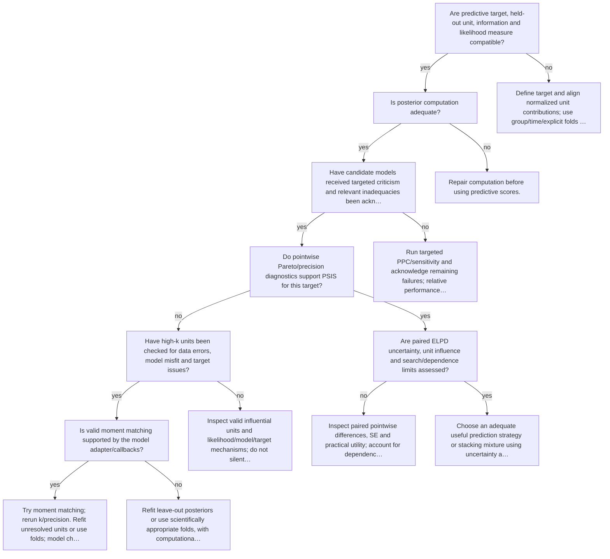

# Validate predictive comparison and PSIS

Executable specification: [`trees.json`](trees.json), tree `psis-loo`. Supply boolean facts only after inspecting evidence. Omitted facts follow **unknown** and request a check. A terminal action is a next step, not an automatic declaration of adequacy; after an intervention rerun the named trees.

| Fact | Required evidence / question |
|---|---|
| `target_compatible` | Are predictive target, held-out unit, information and likelihood measure compatible? |
| `computation_adequate` | Is posterior computation adequate? |
| `candidate_criticism_done` | Have candidate models received targeted criticism and relevant inadequacies been acknowledged? |
| `pareto_reliable` | Do pointwise Pareto/precision diagnostics support PSIS for this target? |
| `influence_examined` | Have high-k units been checked for data errors, model misfit and target issues? |
| `moment_matching_supported` | Is valid moment matching supported by the model adapter/callbacks? |
| `difference_uncertainty_examined` | Are paired ELPD uncertainty, unit influence and search/dependence limits assessed? |

## Routes

Unknown branches and full action text are intentionally in the executable specification. Conditional recommendations in action text still require the named evidence; the runner does not fit models or infer boolean facts from incomplete summaries.

Evidence: statistical guides linked by each action; graph/action ordering `synthesized` from E15 and diagnostic modules.
