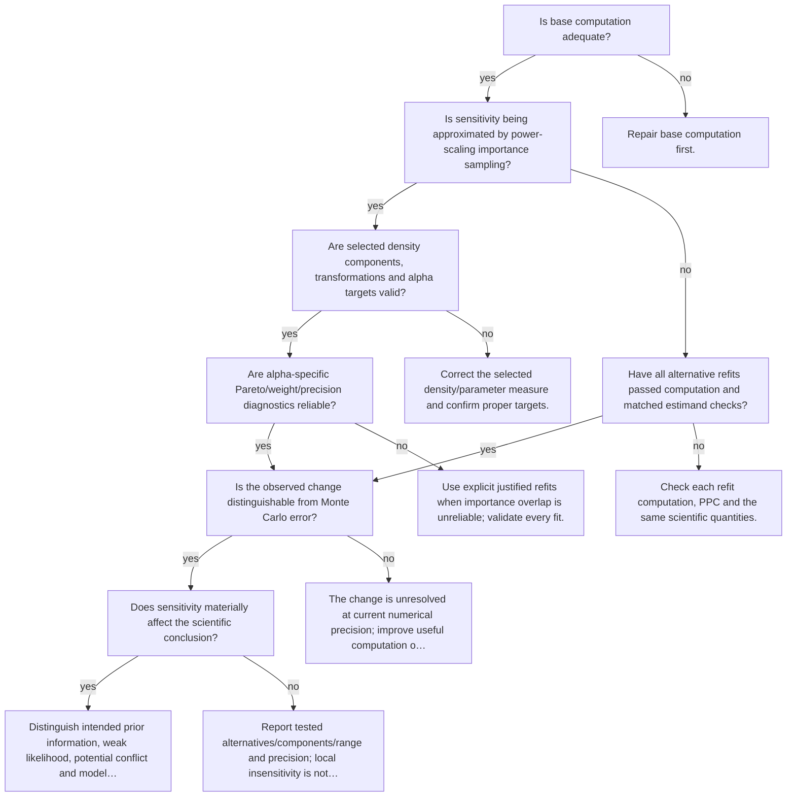

# Validate and interpret sensitivity

Executable specification: [`trees.json`](trees.json), tree `sensitivity`. Supply boolean facts only after inspecting evidence. Omitted facts follow **unknown** and request a check. A terminal action is a next step, not an automatic declaration of adequacy; after an intervention rerun the named trees.

| Fact | Required evidence / question |
|---|---|
| `computation_adequate` | Is base computation adequate? |
| `using_power_scaling` | Is sensitivity being approximated by power-scaling importance sampling? |
| `density_components_valid` | Are selected density components, transformations and alpha targets valid? |
| `importance_reliable` | Are alpha-specific Pareto/weight/precision diagnostics reliable? |
| `refits_valid` | Have all alternative refits passed computation and matched estimand checks? |
| `change_exceeds_mcse` | Is the observed change distinguishable from Monte Carlo error? |
| `practically_material` | Does sensitivity materially affect the scientific conclusion? |

## Routes

Unknown branches and full action text are intentionally in the executable specification. Conditional recommendations in action text still require the named evidence; the runner does not fit models or infer boolean facts from incomplete summaries.

Evidence: statistical guides linked by each action; graph/action ordering `synthesized` from E15 and diagnostic modules.
