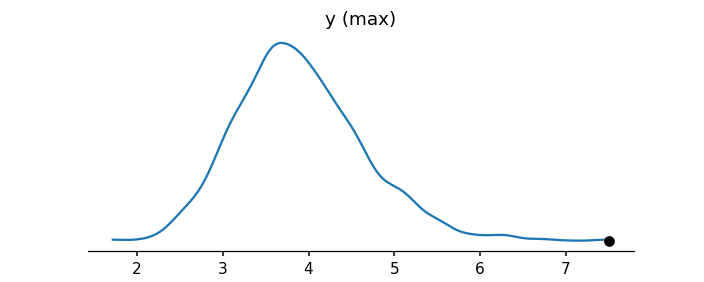
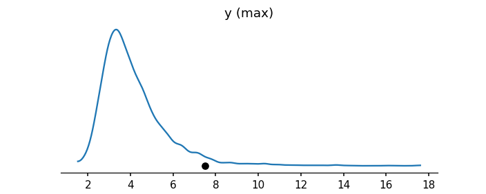
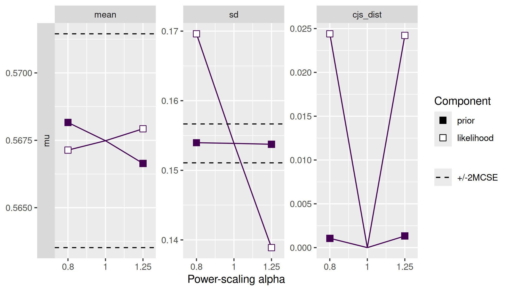
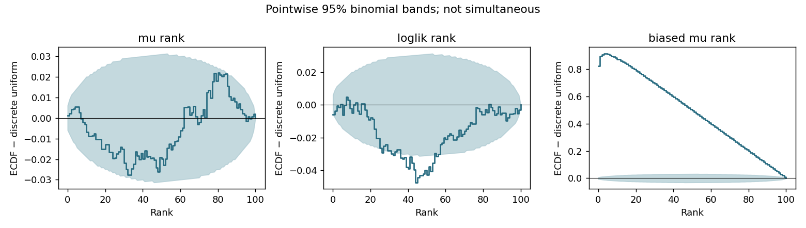

# Interpret the recorded examples

Source: E04/E05/E06/E07/E08/E09/E13; statistical decisions below are synthesized applications, with R mechanics translated and method/API evidence in the relevant guides. Numerical results come from [runtime records](../validation/runtime-results.json), [diagnostic tables](../validation/normal-diagnostics.csv), [targeted PPCs](../validation/targeted-ppc.csv) and [comparison](../validation/comparison.csv).

## A model can compute adequately and miss the scientific feature

The reproducible PyMC example fits a Normal and a fixed-df Student-t response model to 80 continuous observations including a large value. It declares an illustrative precision budget, validates chains/ESS/MCSE and HMC warnings, then asks whether predictions reproduce tail behavior. The observed maximum is 7.5; the Normal replicated-max median is about 3.84 and its 95th percentile about 5.21. Its mean and SD PPCs look much less troubling. A generic location/spread plot would miss the specific criticism.

The Student-t model produces a broader predictive tail, but the observed maximum still lies above its replicated-max 95th percentile (about 7.06). This is useful comparative evidence, not an adequacy verdict. Examine other scientifically relevant tail probabilities, covariates and measurement explanations; do not automatically add a mixture or remove a valid observation.

Normal raw PSIS has max k about 0.94. Supported moment matching brings it to about 0.37 without changing the model. The unrepaired score is retained for diagnosis, while comparison uses the repaired estimate. The recorded difference is roughly 10 log-score units with a paired SE about 7.7 and a small-N warning. Candidate ranking and a stacking weight near a boundary do not settle the substantive decision. Model criticism remains required.

The subsample example starts with 20 units, then requests 40 **additional** units in Python; it ends at 60 and reduces estimated subsampling error. The R demonstration updates 10 sampled units to **25 total**. Neither is a large-data benchmark. Choose precision for the paired predictive difference and diagnose sampled influential units.

## Shared draws isolate translation mistakes

The analytic Normal example uses the same stored independent draws in both languages, with a known observation SD and an exact leave-out predictive reference. Maximum R/Python pointwise ELPD differences are about 1.2e-6, while the largest PSIS-minus-exact error is about 0.0038. These checks detect axes, normalization and scoring mistakes without confusing different samplers with language translation.

Bulk ESS, R-hat and mean MCSE match to displayed precision; Pareto estimates and importance ESS have small retained implementation differences. Preserve R's sample-SD convention with `ddof=1` in a Python statistic. Preserve per-unit R relative efficiencies through the tested scalar-PSIS branch when ArviZ's top-level LOO interface accepts only one scalar. Do not infer that all model adapters have identical features.

## Sensitivity is an interpretation problem

The analytic base and stronger-prior fits expose prior-versus-likelihood responses. Use the actual scientific contrast and selected factors, validate power-specific weights, and compare shifts with MCSE. A strong-prior label is not a reason to weaken a scientifically justified prior; a low local gradient is not global robustness.

## SBC validates inference under a generative experiment

The analytic SBC examples simulate a proper prior, data, and exact posterior draws; rank both a parameter and a data-dependent joint likelihood. A deliberately shifted posterior is an obvious positive control. The Python likelihood ECDF has pointwise-band excursions, which must not be relabeled as a clean simultaneous pass. Retain the finite-simulation evidence and use prespecified simultaneous diagnostics/more simulations when making a calibration claim. A two-fit simuk smoke run verifies API mechanics only.

This experiment does not check whether the likelihood fits real data. A custom Stan implementation must replace the analytic inference step, retain fit failures, examine ranks with autocorrelation/tie handling, and also perform ordinary fit diagnostics and real-data PPCs.
